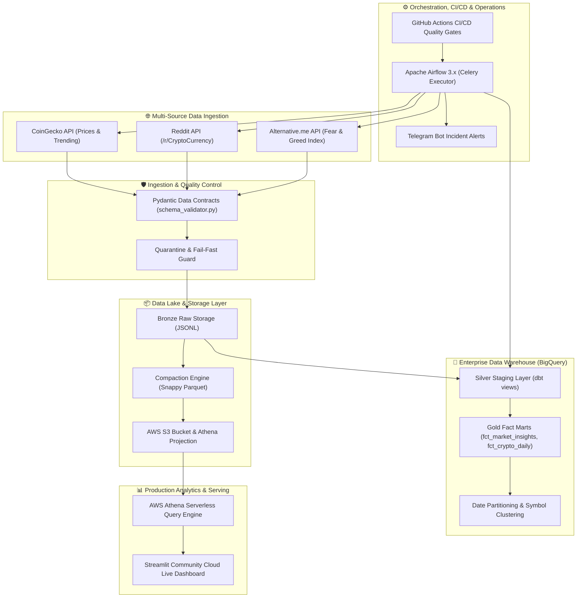

# ⚡ Production-Grade Crypto Data Pipeline & Market Intelligence Platform

[](https://crypto-data-pipeline-binhg.streamlit.app/)
[](https://airflow.apache.org/)
[](https://www.getdbt.com/)
[](https://aws.amazon.com/)
[](https://github.com/features/actions)

An **Enterprise-Grade, Zero-Cost, Production Data Engineering Pipeline** that ingests multi-source cryptocurrency market data and social sentiments (CoinGecko, Reddit, Fear & Greed Index, Trending Coins), enforces Pydantic data contracts, transforms data via dbt BigQuery Incremental models with Medallion Architecture, orchestrates tasks via Apache Airflow, and serves live interactive analytics via **AWS Athena + Streamlit Cloud**.

👉 **Live Demo Dashboard**: [crypto-data-pipeline-binhg.streamlit.app](https://crypto-data-pipeline-binhg.streamlit.app/)

---

## 🏛️ System Architecture



---

## 💎 3-Tier Medallion Data Architecture

1. **Bronze Layer (Raw Data Lake Zone)**:
   * **Raw JSONL Snapshots**: Preserves raw API responses (`coingecko/`, `reddit/`, `fear_greed/`, `trending_coins/`) for auditing and full backfill replayability.
   * **Data Lake Compaction Engine**: Merges small JSON files into compressed, columnar **Snappy Parquet** format for zero-latency Athena queries.
2. **Silver Layer (Cleaned & Standardized Zone)**:
   * dbt Staging Models (`stg_coingecko`, `stg_reddit`, `stg_fear_greed`, `stg_trending_coins`).
   * Handles type coercion, timestamp unification, data sanitization, and deduplication.
3. **Gold Layer (Curated Business Marts)**:
   * Star-Schema Dimensional Data Marts (`dim_coin`, `dim_date`, `fct_crypto_daily`, `fct_market_insights`).
   * Computes **Composite Sentiment Scores (0-100)** and **7-Day Rolling Price vs Reddit Activity Correlations**.

---

## 🏆 Enterprise 8-Point Production Engineering Roadmap

| Part | Production Feature | Implementation Details | Status |
| :--- | :--- | :--- | :---: |
| **Part 1** | **Incremental ETL & Idempotency** | `incremental_strategy='merge'`, `unique_key='record_id'`, 3-day Lookback Window | ✅ **Production** |
| **Part 2** | **Data Quality Suite** | 56 automated dbt tests (`not_null`, `unique`, `accepted_range`, `relationships`) | ✅ **Production** |
| **Part 3** | **Schema Drift Guard** | Pydantic Data Contract & Quarantine Pattern (`utils/schema_validator.py`) | ✅ **Production** |
| **Part 4** | **Real-time Alerting** | Telegram Bot HTML instant failure dispatching via Airflow `on_failure_callback` | ✅ **Production** |
| **Part 5** | **Unified Secrets Manager** | GCP/AWS Secrets Manager with zero-cost local `.env` fallback (`secrets_manager.py`) | ✅ **Production** |
| **Part 6** | **CI/CD Quality Gates** | GitHub Actions (`black`, `flake8`, `pytest`, `dbt parse`, Continuous Deployment) | ✅ **Production** |
| **Part 7** | **Historical Backfill Strategy** | `utils/backfill.py` CLI & Airflow Native Time-Traveler Backfill Engine | ✅ **Production** |
| **Part 8** | **Performance & Storage Tuning** | BigQuery Date Partitioning, `coin_id` Clustering & Parquet Compaction Engine | ✅ **Production** |

---

## 💻 Tech Stack & Infrastructure

* **Languages**: Python 3.11, SQL (BigQuery/Athena Dialects), Bash
* **Data Processing & Analytics**: Pandas, PyArrow, Plotly, PyAthena
* **Orchestration**: Apache Airflow 3.x (Docker Compose / Celery Executor)
* **Transformation & Quality**: dbt Core 1.11, Pydantic 2.x, Pytest
* **Data Lake & Warehouse**: AWS S3, AWS Athena, AWS Glue, GCP BigQuery
* **Dashboard Serving**: Streamlit Community Cloud (Live 24/7 Deployment)
* **DevOps & MLOps**: Docker, GitHub Actions, Telegram API

---

## 📁 Repository Structure

```text
├── .github/workflows/   # GitHub Actions CI/CD Pipeline (Linting, Pytest, dbt parse, CD)
├── config/              # Centralized Settings & Multi-Coin API Configurations
├── crypto_transform/    # dbt Core Project (Staging, Marts, Schema Quality Tests)
├── dags/                # Apache Airflow 3.x Orchestration DAGs
├── dashboard/           # Streamlit Live Analytics Dashboard (app.py & requirements.txt)
├── docs/                # System Architecture, Upgrade Summary & Operational Runbook
├── ingestion/           # Data Ingestion Engines with Pydantic Schema Guards
├── tests/               # Automated Pytest Suite for Data Contracts & Alerts
├── utils/               # Central Utilities (Alerts, Backfill, Compaction, Secrets)
└── warehouse/           # AWS Athena DDLs & Glue Crawler Setup Scripts
```

---

## 🚀 Quick Start Guide

### 1. Clone & Set Up Environment
```bash
git clone https://github.com/BinHG05/crypto-data-pipeline.git
cd crypto-data-pipeline
python -m venv .venv
source .venv/bin/activate
pip install -r requirements.txt
```

### 2. Configure Environment Secrets
Copy template credentials and update AWS, Telegram, or GCP values:
```bash
cp .env.example .env
```

### 3. Launch Airflow Container Services
```bash
docker compose up -d
```
*Access Airflow Web UI at*: `http://localhost:8080` (Credentials: `airflow` / `airflow`)

### 4. Execute dbt Incremental Transformations & Tests
```bash
docker compose exec airflow-scheduler bash -c "cd /opt/airflow/crypto_transform && dbt run && dbt test"
```

### 5. Launch Streamlit Local Dashboard
```bash
streamlit run dashboard/app.py --server.port 8501
```
*Access Local Dashboard at*: `http://localhost:8501`

---

## 📚 Project Documentation

* 📄 **[Production Upgrade Summary](docs/production_upgrade_summary.md)**: Detailed breakdown of the 8 production architecture stages.
* 📘 **[Operational Runbook](docs/operational_runbook.md)**: Standard Operating Procedures (SOP) for daily operations, alerts, backfilling, and maintenance.

---

## 🔗 Live Production Links
* **Streamlit Live Dashboard**: [https://crypto-data-pipeline-binhg.streamlit.app/](https://crypto-data-pipeline-binhg.streamlit.app/)
* **Repository**: [https://github.com/BinHG05/crypto-data-pipeline](https://github.com/BinHG05/crypto-data-pipeline)
