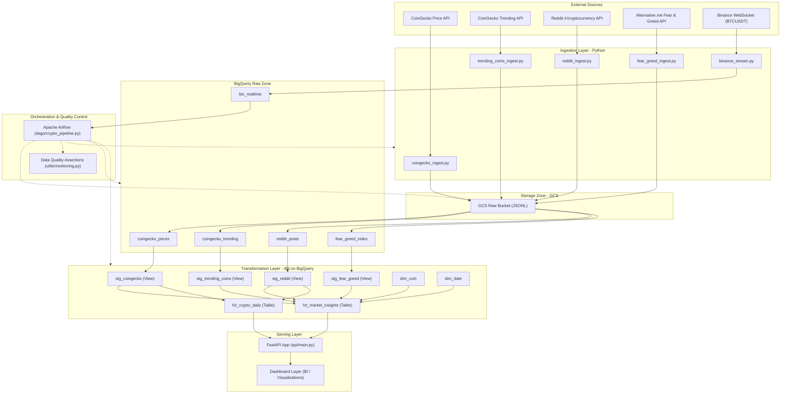

# Architecture Diagram & Pipeline Flow

This document details the updated end-to-end data architecture for the Crypto Data Pipeline. It reflects the inclusion of the new analytical datasets (Fear & Greed Index, Trending Coins) alongside the existing CoinGecko and Reddit batch flows, and the Binance live trade stream.

## End-to-End Pipeline Architecture

## Detailed Data Flows

### 1. Ingestion Flow (Batch & Stream)
- **Batch Pipeline**: Managed by Airflow on a `@daily` schedule. It fetches raw snapshots, writes them to a local landing zone (`/data/raw/`), validates that they are non-empty, and uploads them to a GCS bucket.
- **Streaming Pipeline**: Runs as a continuous daemon script `binance_stream.py` fetching real-time trade events from Binance and inserting them directly into the BigQuery `btc_realtime` table. A secondary Airflow DAG monitors its freshness.

### 2. Loading Flow
- The batch loader in `load_to_bigquery.py` loads daily GCS JSONL payloads into raw tables in BigQuery using `WRITE_APPEND` mode.

### 3. Transformation Flow (dbt)
- **Staging**: Views are created over raw tables, cleaning up types, renaming columns, and deduplicating records by custom surrogate keys.
- **Marts (Facts & Dimensions)**: 
  - `dim_coin` contains coin properties (e.g., id, symbol, name).
  - `dim_date` is a date dimension table.
  - `fct_crypto_daily` combines CoinGecko daily average prices and Reddit discussion volume.
  - `fct_market_insights` (New) combines coin prices, Reddit metrics, Fear & Greed index values, and trending statuses to calculate composite Sentiment Scores and rolling correlations.

### 4. API & Application Layer
- A FastAPI application query BigQuery marts on-demand to serve daily metrics and correlation insights to external clients or visualization dashboards.

## Chi tiết từng Tầng trong Dự án

### Tầng 1: Nguồn Dữ Liệu (Sources)
*   **CoinGecko Price API**: Trả về snapshot giá hiện tại của BTC và ETH.
*   **CoinGecko Trending API**: Trả về danh sách top các đồng coin đang thịnh hành (được tìm kiếm nhiều nhất).
*   **Reddit API**: Lấy các bài viết nóng hổi từ subreddit `/r/cryptocurrency` để phân tích thảo luận xã hội.
*   **Fear & Greed Index API**: Lấy chỉ số đo lường nỗi sợ hãi và lòng tham của thị trường.
*   **Binance WebSocket**: Streaming giao dịch trực tiếp cặp BTCUSDT theo thời gian thực.

### Tầng 2 & 3: Ingestion & Landing Zone
*   Các script Python thu thập dữ liệu lô lưu trữ tạm thời thành các tệp JSONL tại cục bộ `data/raw/{source}/{date}/data.jsonl`.
*   Airflow chạy tác vụ kiểm tra DQ cơ bản (tệp không rỗng) rồi tải các tệp này lên **Google Cloud Storage (GCS)** làm tầng Data Lake thô.
*   **Binance Stream** chạy độc lập dưới dạng một background daemon kết nối socket và ghi thẳng vào BigQuery.

### Tầng 4 & 5: BigQuery Warehouse & dbt Transformation
*   Dữ liệu từ GCS được nạp vào BigQuery raw bằng script [load_to_bigquery.py](file:///d:/crypto-data-pipeline/warehouse/load_to_bigquery.py) (sử dụng tính năng `autodetect=True` đã sửa).
*   **dbt Staging**: Làm sạch kiểu dữ liệu, chuẩn hóa tên cột và lọc trùng bản ghi (deduplication) sử dụng kỹ thuật `ROW_NUMBER() OVER (...)`.
*   **dbt Dimensions**: Tạo bảng chiều thời gian `dim_date` và chiều coin `dim_coin`.
*   **dbt Marts**:
    *   `fct_crypto_daily`: Tổng hợp giá trung bình và số bài đăng Reddit theo ngày.
    *   `fct_market_insights`: Tạo chỉ số tâm lý tổng hợp (`sentiment_score`), giá trung bình trượt 7 ngày (`avg_price_7d`), và hệ số tương quan rolling 7 ngày (`price_social_corr_7d`).

### Tầng 6: Serving Layer
*   Endpoint FastAPI tại [main.py](file:///d:/crypto-data-pipeline/api/main.py) kết nối BigQuery, cung cấp API phục vụ dữ liệu đã biến đổi cho ứng dụng bên ngoài hoặc Dashboard BI.

### Tầng 7: Orchestration & Data Quality
*   **Airflow** điều khiển toàn bộ luồng công việc từ lúc fetch dữ liệu cho đến khi kiểm tra tính toàn vẹn (DQ) của Data Mart cuối cùng.
*   Bất kỳ bước nào bị thất bại (lỗi API, dữ liệu trống, dbt test thất bại) đều kích hoạt cảnh báo thông qua **Slack Webhook** hoặc **Email**.
