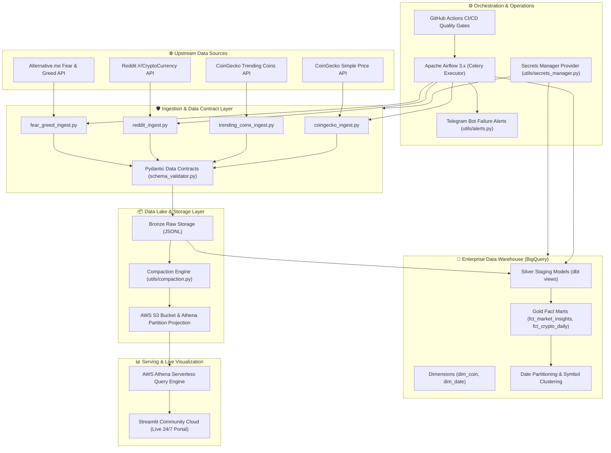

# 🏛️ End-to-End Enterprise System Architecture

This document details the production-grade end-to-end data architecture for the **Crypto Data Pipeline & Market Intelligence Platform**.

---

## 📐 Full Architecture Diagram

---

## 💎 Data Layer Specifications

### 1. Bronze Layer (Raw Data Lake)
* **Format**: Original `.jsonl` files stored under `data/raw/{source}/{dt}/`.
* **Compaction**: `utils/compaction.py` merges small JSON files into compressed, columnar **Snappy Parquet** files to eliminate small-file read overhead.
* **AWS S3 Integration**: Automatically synced to S3 buckets with Athena Partition Projection.

### 2. Silver Layer (Cleaned & Standardized dbt Staging)
* **Models**: `stg_coingecko`, `stg_reddit`, `stg_fear_greed`, `stg_trending_coins`.
* **Transformations**: Type casting, timestamp standardization (UTC), text sanitization, surrogate key generation.

### 3. Gold Layer (Curated Business Marts)
* **Models**: `fct_crypto_daily`, `fct_market_insights`.
* **Optimizations**: 
  * **Date Partitioning**: `partition_by={"field": "report_date", "data_type": "date"}`.
  * **Clustering**: `cluster_by=["coin_id"]`.
  * **Idempotency**: `incremental_strategy='merge'`, `unique_key='record_id'`.

---

## 🔗 Live Serving
* **Streamlit Live Portal**: [https://crypto-data-pipeline-binhg.streamlit.app/](https://crypto-data-pipeline-binhg.streamlit.app/)
